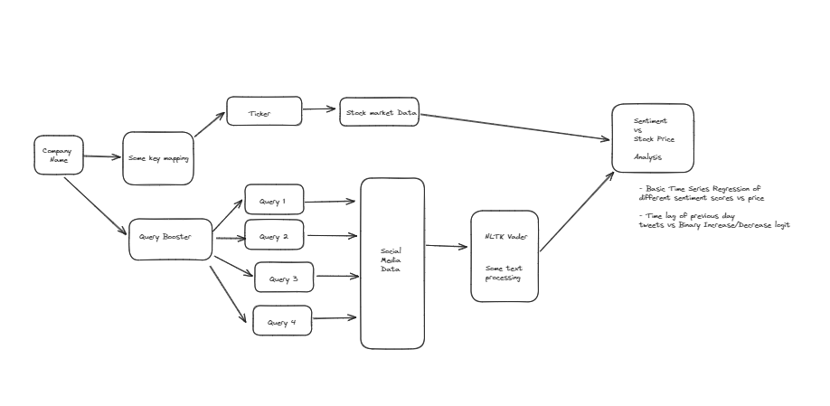

# twitter-stock-analysis

Function that uses twitter data to evaluate the stock of certain companies

## Installation
Use pip to install the required packages

```bash
pip install -r requirements.txt
```

Use conda to install the required packages

```bash
conda install --file requirements.txt
```

## Execution
The analysis can be run from the file `analysis.ipynb`

the overall flow should be as follows
    